# Order Book Observatory

A live Hyperliquid order-book widget. It shows not just where depth is, but what is happening to it: what was added, what was pulled, what was eaten, and how fast a level comes back.

The venue sends snapshots, not order events. Everything derived from them is either an exact consequence of those snapshots or an honestly labelled heuristic — and the widget says which.

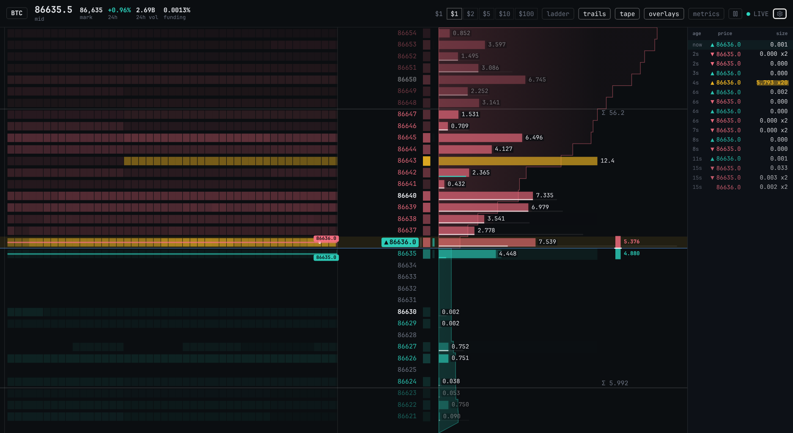

```
npm install
npm run dev                                                # live socket
npm run dev -- --open '/?fixture=btc-perp-active&speed=1'  # replay a recording
npm run check                                              # typecheck, lint, 150 unit tests
npm run e2e                                                # 17 Playwright tests
```

---

## Feature guide

### The top bar

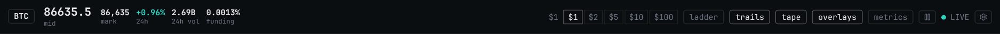

Left to right: the pair button (`/`), the mid, the grouping the server confirmed, the grouping segment (`[` and `]`), the view and column toggles, 24 h stats, pause (space), the connection dot, and settings.

**Pause freezes the picture, not the feed.** The engine keeps folding every push while paused — only sampling and painting stop, so the canvas holds the frame it had and the loop does no work at all. Resuming shows the book as it is _now_; the paused interval is never replayed as animation. The connection dot stays live while paused, so a drop is still visible.

The connection dot is not decoration: `LIVE`, `STALE` (no push inside the stream's expected interval), `RESYNCING` (a grouping change is in flight) and `DISCONNECTED` are distinct states, and the ladder behaves differently in each.

### The ladder

Each row is one price on the grouping grid, and carries, from the centre outwards: the price label (round grid multiples are brighter), a heat cell whose colour saturates with relative size, the size bar, and the size itself. Round numbers are emphasised because that is where resting liquidity clusters.

Rows outside the depth ruler are dimmed rather than hidden, so the shape of the book beyond the ruler is still legible. `Σ` labels mark the ruler's cumulative depth at each stop.

### Motion and pulses

A level that changes does not simply redraw. It pulses by _kind_: an outline for an add, a colour lift for a grow, a ghost bar showing exactly what was lost on a shrink, and a fade on vanish. Rows spring to their new y rather than jumping, so a ladder that shifts by one tick reads as motion, not as a new screen. `prefers-reduced-motion` turns the springs off.

### Trails and the touch paths

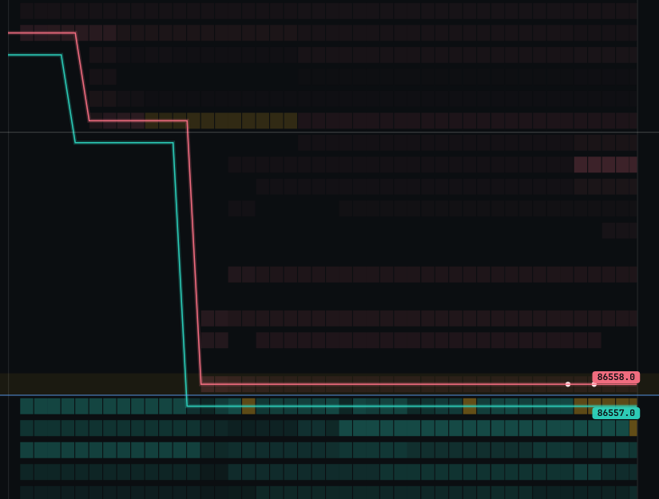

The left column is twelve seconds of history for every visible level: one tile per sample, coloured by that level's size at the time. A level that has been sitting there for ten seconds looks nothing like one that appeared 400 ms ago.

Drawn over it are the bid and ask touch paths — where the best bid and best ask have actually been — with a white dot at each print and a price tag at the right edge. The tag prints only when the real BBO is known: after a grouping change the engine keeps the true touch rather than showing an aggregated price that would look precise and be wrong.

### Metric overlays

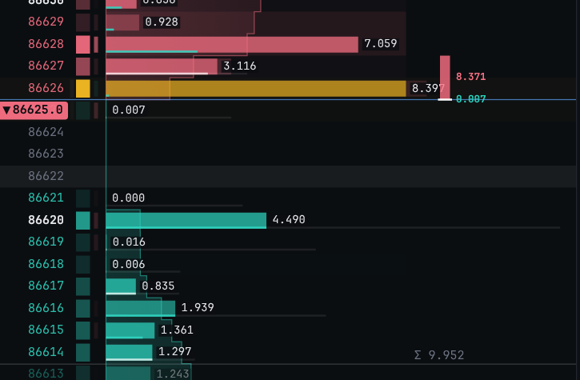

Toggled with `o`. In the shot above, reading left to right on each row: the price label, the heat cell, then the narrow overlay strip before the size bar.

- **Size-delta field** — the narrow strip per row, whose colour and height encode the decayed sum of size changes at that price (τ = 3 s). Teal means net adds, rose means net pulls. It is deliberately _not_ called order-flow imbalance: the feed carries no order events (ADR 0005).
- **Resiliency bars** — the thin light line under a size bar, on a level that lost at least half its size; it fills as the level refills.
- **Migration connectors** — a dashed line with a dot when a level vanished at one price and an equal-sized one appeared within three ticks in the same push. That pairing is a heuristic, not a fact.

The dimmed band (here on 86622) is the hover highlight, painted on the canvas itself because there are no DOM rows to style. The tagged row is the touch, and `Σ` marks a ruler stop's cumulative depth.

### The trades tape

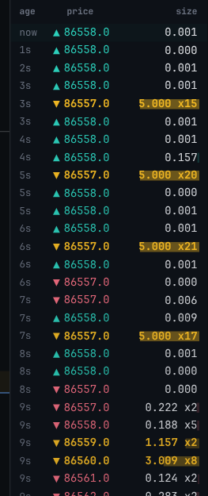

Prints, newest first, aligned with the row they hit: age, direction mark, price, size, and an `x n` badge when consecutive prints at one price are folded. Sizes above the tape's 95th percentile are highlighted, so a real sweep stands out from noise.

### The spine

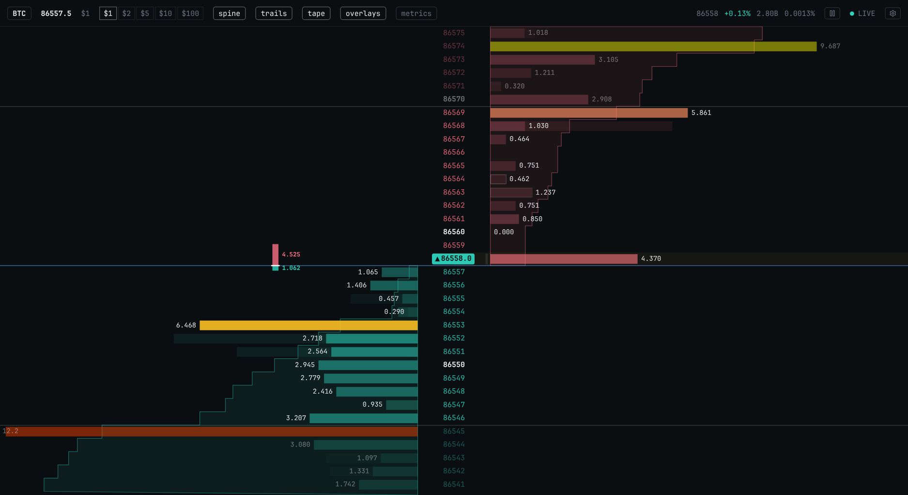

`v` switches to a centre-out reading: prices down the middle, size growing outward, mirrored cumulative depth profiles behind. It is the same book with the trails and tape columns reclaimed, and it is what narrow hosts get automatically.

### The metrics HUD

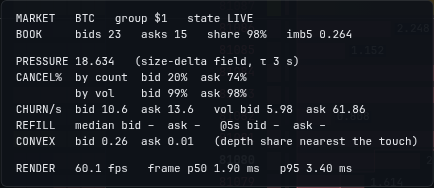

`m` opens the HUD: pressure, cancel ratios by count and by volume, churn, median refill and refill-at-5 s, convexity, and render telemetry. It is written straight to the DOM by ref at 2 Hz — React does not re-render for it, and an end-to-end test asserts exactly that.

### Pair picker

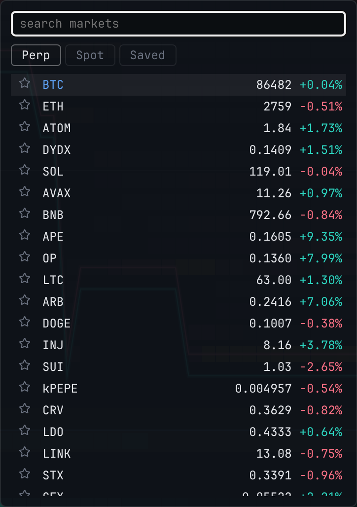

`/` opens it: search, Perp / Spot / Saved tabs, arrow keys and Enter, favourites. Switching coin resets the engine and resubscribes.

Rows are ranked, not left in venue order: an exact ticker match first, then prefix matches, then by 24 h notional volume — the only liquidity proxy the stats endpoint offers — with an alphabetical tiebreak. Typing `eth` puts ETH above ETHFI regardless of size. Prices and 24 h changes come from one shared, deduplicating `/info` fetch.

### Settings

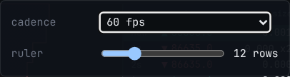

Render cadence (60 fps, 30 fps, or draw only on update) and how far the depth ruler reaches. These are preferences: they persist in `localStorage` and stay out of the URL, while everything shareable (coin, grouping, columns, view) lives in the URL (ADR 0008).

### Grouping

The segment asks the venue for a different aggregation. The widget freezes and dims the old ladder while the change is in flight rather than mixing rows from two grids, and the dot reads `RESYNCING` until the new grid is confirmed. A shared link carrying `?g=` subscribes at that grouping directly.

### Responsive, touch, accessibility

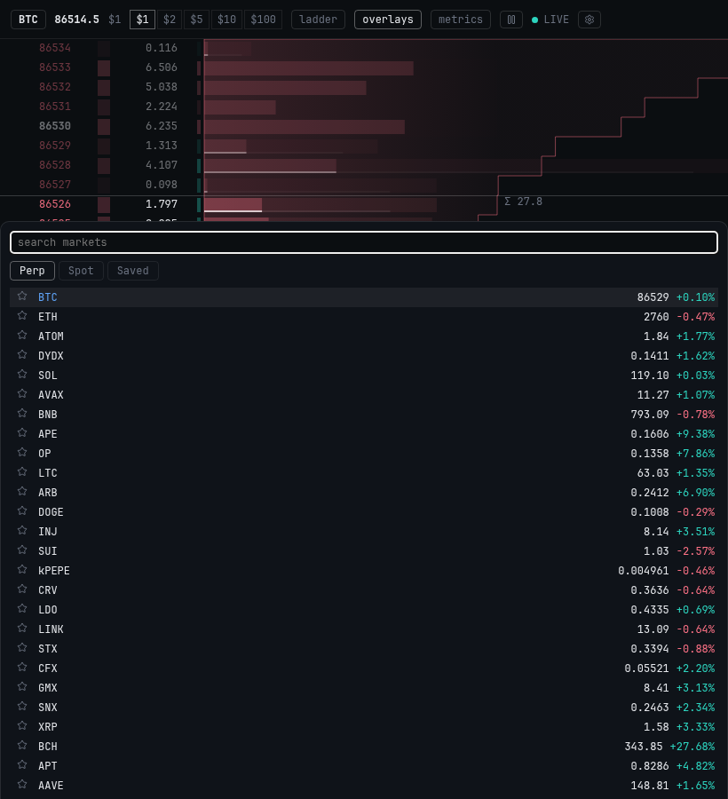 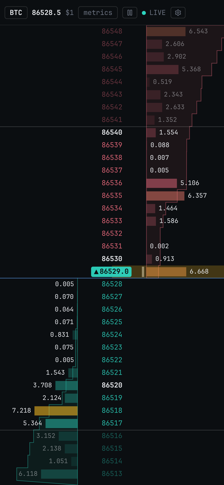

Columns leave in order of what they cost against what they add: tape below 1280 px, trails below 900 px, overlays below 600 px, where the spine takes over. Popovers become bottom sheets below 900 px. Pinch changes grouping where there is no keyboard. The canvas carries a text alternative, and a polite live region announces mid and connection at no more than 1 Hz.

---

## Architecture

Three layers, one direction: rendering reads state, state reads data, nothing pushes back (ADR 0003).

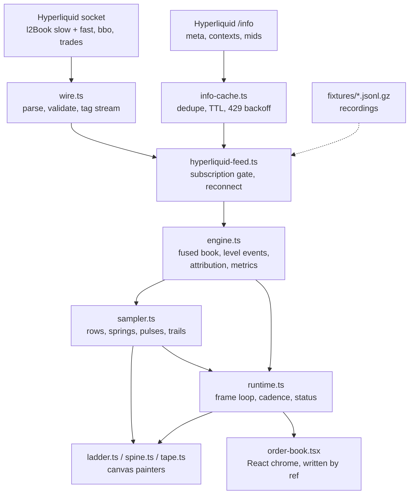

- **Data** (`src/data`) — wire parsing, the subscription gate, the snapshot-native engine, attribution, metrics.
- **State** (`src/state`) — per-frame sampling, springs, trails, tape, preferences, URL state.
- **Rendering** (`src/render`) — stateless painters over a `DrawContext`.
- **Chrome** (`src/widget`) — the React shell, which never re-renders for a frame.

## Decisions

| ADR                                                    | Decision                                                                             |
| ------------------------------------------------------ | ------------------------------------------------------------------------------------ |
| [0001](docs/adr/0001-snapshot-native-engine.md)        | Snapshot-native engine: the feed has no deltas, so the book is a fold over snapshots |
| [0002](docs/adr/0002-integer-raw-tick-prices.md)       | Prices are integer raw ticks; a float never indexes a level                          |
| [0003](docs/adr/0003-data-state-rendering-layers.md)   | Data / state / rendering, one way                                                    |
| [0004](docs/adr/0004-canvas-2d-worker-deferred.md)     | Canvas 2D on the main thread; a Worker stays deferred behind the renderer interface  |
| [0005](docs/adr/0005-size-delta-field-not-ofi.md)      | The size-delta field is not order-flow imbalance, and is not called it               |
| [0006](docs/adr/0006-synthetic-benchmarks-labelled.md) | Synthetic load is labelled synthetic                                                 |
| [0007](docs/adr/0007-four-streams-window-authority.md) | Four streams, each authoritative over its own window                                 |
| [0008](docs/adr/0008-react-chrome-patterns.md)         | React owns chrome only; frames are written by ref                                    |
| [0009](docs/adr/0009-visual-layer-ports-v4.md)         | The visual layer is a port of the v4 prototype; every deviation is recorded          |

Feed facts behind these — tick derivation, aggregation grids, observed cadences — are summarised in the quirks section below; the raw research notes are kept out of this repo.

## Quirks we hit

Things that cost real time, written down so they cost nobody else any.

**The venue**

- `l2Book` is a **full snapshot**, not a delta, and carries no sequence number. There is nothing to resynchronise against, so the book is a fold and out-of-order pushes are last-writer-wins. A scenario test states exactly that.
- Two subscriptions at different precisions are **indistinguishable on the wire**: same channel, same coin, no echo of the aggregation. Changing grouping therefore means unsubscribe, subscribe, and gate the incoming pushes on an on-grid check until the new grid is confirmed.
- `levels[0]` is bids descending and `levels[1]` asks ascending — **observed, never documented**. The wire layer asserts it instead of trusting it.
- The socket drops at 60 s of silence; a ping every ~50 s keeps it. `{nSigFigs: 5, mantissa: 1}` returns HTTP 500 with a null body, so the base grid omits the mantissa.
- `/info` **rate-limits hard**. Naively, mounting the widget fired four `/info` calls plus a 10 s stats poll and earned a 429 storm. One shared fetch now dedupes in-flight bodies, caches per payload type, and serves the last good body during a 30 s backoff.
- Spot markets are absent from `metaAndAssetCtxs` entirely; they need `spotMetaAndAssetCtxs`, whose contexts are positional against `spotMeta.universe` and carry `midPx`/`prevDayPx`/`dayNtlVlm` but never funding. Pricing spot from `allMids` alone — as this did at first — yields a bare number with no 24 h change. `allMids` remains the fallback for the ~24 of 305 pairs the venue publishes no context for. Spot rows whose token indexes are missing are skipped rather than half-built.
- Trades and book pushes have **no guaranteed causal order**, so "consumed vs cancelled" can only ever be a temporal join with a 600 ms grace window — and it is labelled a heuristic everywhere it appears.
- The mid crossing a power of ten changes what a fixed `nSigFigs` means, so the grid is re-derived when the decade changes.

**The engine, under load**

- The burst benchmark, not a unit test, exposed the real scaling wall: the attribution join and the metric windows were **arrays that got scanned**. A 15 s print window at one price, a 60 s decrease window per side, and a grace list of open decreases are all trivial at the live 30 events/s and all quadratic when the rate climbs. Indexing them — prints by price with prefix sums and binary search, decreases by price with a cursor, the ratio window as fixed 250 ms buckets — took apply p50 from rate-dependent milliseconds to a flat ~4 µs, and sustained throughput at a synthetic 100k events/s from 1,388 to 28,653 events/s — a 20x improvement that no amount of profiling the render path would have found.
- There is still a floor, and it is honest: a 15 s window at 100k events/s is inherently ~10⁶ retained prints, so above ~50k events/s the cost is allocation and GC, not lookup. That floor is visible in the table: apply p50 stays flat while sustained throughput falls as the heap fills. The table below shows it as heap delta, and the numbers are from a laptop 4700U, not a server.
- A burst harness that omits the host `tick` measures an engine that never prunes. That is a bug in the harness, not headroom in the engine.

**The widget**

- Presentation ingestion must not be welded to painting. Folding engine output into pulses, trails and tape inside the paint path means every skipped frame — a hidden tab, a quiet book under the `on update` cadence — silently skips ingestion too: the trail column grows holes for time that was never sampled, and the engine's queues grow with no consumer. `ingest` runs on a timer, `project` runs on paints.
- Pause is an easy thing to get backwards. Dropping events at the feed listener looks like "pause" and is actually data loss: the book silently diverges from the venue, and resuming shows a stale market. The ingest path and the presentation path have to be paused separately, and only the presentation one should ever stop.

**The browser**

- The canvas is DPR-scaled: Playwright's `clip` is CSS pixels while `getImageData` is device pixels. Mixing them silently samples the wrong place.
- A hidden tab throttles `requestAnimationFrame`, so returning to one would otherwise replay minutes of animation. The first visible frame folds what queued and settles.
- Icons cannot be drawn from a DOM icon set onto a canvas, so direction marks are drawn paths; the DOM chrome uses `lucide-react`.
- A React root's `display` rule beats `[hidden]`; the metrics panel is mounted only while metrics are on.
- Fixture feeds can only honour their recorded precision, so during replay the segment shows the _requested_ grouping while the dot reads `RESYNCING`.

## Proof

- **Replay invariants** — every recording in `fixtures/` is folded event by event, asserting sorted sides, an uncrossed touch, on-grid prices, monotone cumulative depth, and at most one version bump per applied event.
- **Scenario tests** — deliberately broken copies of a recording: duplicated push, non-monotonic push, garbage line, structurally wrong frame, off-grid price, drop and reconnect. Each states what is dropped and what the book looks like afterwards.
- **Property tests** — tick round-trips, diff reconstruction, URL round-trip.
- **End to end** — rows paint, grouping resubscribes, the pair picker resets the book, a shared link's grouping survives a load, the phone layout reaches LIVE and paints the spine, the widget is fully operable from the keyboard, and twenty mount/unmount cycles release every listener, timer and observer.

## Benchmarks

Generated by `npx vite-node scripts/bench.ts`, never typed by hand (ADR 0006). Benches are run on demand, never in CI, and the results JSON is committed.

<!-- bench:start -->

Measured on AMD Ryzen 7 4700U with Radeon Graphics (8 cores), Node v26.8.1, 2026-09-23.

**Engine burst — synthetic.** Real frames from `fixtures/btc-perp-active.jsonl.gz` re-stamped onto a faster clock and replayed back to back. The live feed peaks near 30 events/s, so these rates say how much headroom there is, not what the venue does.

| Synthetic rate         | Sustained | apply p50 | apply p99 | Heap delta |
| ---------------------- | --------- | --------- | --------- | ---------- |
| 1,000/s (33x live)     | 65,405/s  | 5.31 us   | 105.24 us | -11.3 MB   |
| 10,000/s (333x live)   | 83,352/s  | 4.33 us   | 77.31 us  | 1.6 MB     |
| 50,000/s (1667x live)  | 41,314/s  | 4.33 us   | 203.15 us | 44.7 MB    |
| 100,000/s (3333x live) | 28,653/s  | 4.26 us   | 335.49 us | 131.4 MB   |

**Render — emulated.** The widget replaying that recording at speed 1 in headless Chromium, telemetry read from its own HUD.

| Viewport                           | fps    | frame p50 | frame p95 |
| ---------------------------------- | ------ | --------- | --------- |
| desktop 1500x820 DPR 1, 60 fps cap | 60 fps | 2.6 ms    | 4 ms      |
| phone 390x844 DPR 3, 60 fps cap    | 60 fps | 1.1 ms    | 1.4 ms    |

<!-- bench:end -->
