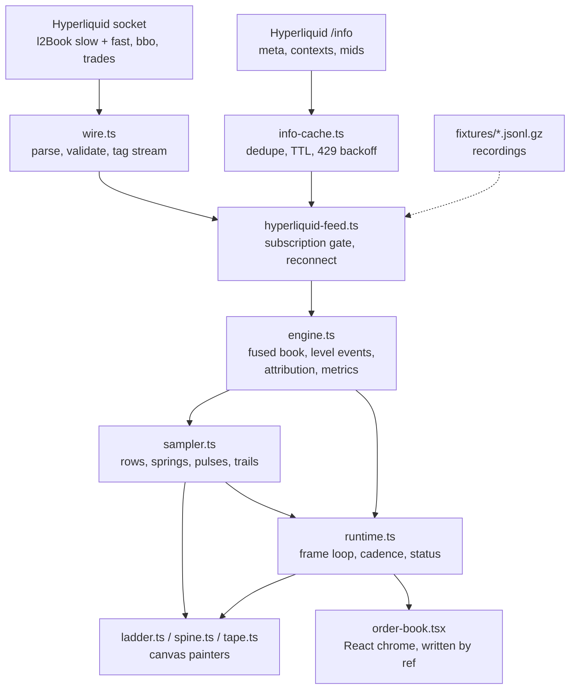

# Order Book Observatory

A live Hyperliquid order-book widget: a price ladder that shows not just where depth is, but what is happening to it — what was added, what was pulled, what was eaten, how fast a level comes back.

The feed gives snapshots, not order events. Everything derived from them is either an exact consequence of the snapshots or an honestly labelled heuristic, and the widget says which.

```
npm install
npm run dev          # live socket
npm run dev -- --open '/?fixture=btc-perp-active&speed=1'   # replay a recording
npm run check        # typecheck, lint, unit tests
npm run e2e          # Playwright
```

## What it shows

- **Ladder** — one row per price on the grouping grid: heat cell, size bar, price label, size, and the trail column showing the last 12 seconds of that level's size.
- **Pulses** — added (outline), grew, shrank with a ghost of what was lost, vanished, and a fill marker when a trade prints at that level.
- **Overlays** (`o`) — the size-delta field strip (decayed sum of size changes, τ = 3 s), resiliency bars, and dashed migration connectors when a level appears to have been repriced.
- **Spine** (`v`) — a narrow centre-out reading of the same book for small hosts.
- **Tape** (`p`) — trades, aligned with the rows they hit.
- **HUD** (`m`) — pressure, cancel ratios, churn, refill medians, convexity, execution cost at a chosen notional, and render telemetry.

Keyboard: `/` pair picker, `[` `]` grouping, `t` trails, `p` tape, `o` overlays, `m` metrics, `v` view, space pause, `Escape` close. Touch: pinch to change grouping.

## Architecture

Three layers, one direction: rendering reads state, state reads data, nothing pushes back (ADR 0003).



- **Data** — `src/data`: wire parsing, the subscription gate, the snapshot-native engine, attribution and metrics.
- **State** — `src/state`: per-frame sampling, springs, trails, tape, preferences and URL state.
- **Rendering** — `src/render`: stateless painters over a `DrawContext`.
- **Chrome** — `src/widget`: the React shell, which never re-renders for a frame.

## Decisions

| ADR | Decision |
| --- | --- |
| [0001](docs/adr/0001-snapshot-native-engine.md) | Snapshot-native engine: the feed has no deltas, so the book is a fold over snapshots |
| [0002](docs/adr/0002-integer-raw-tick-prices.md) | Prices are integer raw ticks; floats never index a level |
| [0003](docs/adr/0003-data-state-rendering-layers.md) | Data / state / rendering, one-way |
| [0004](docs/adr/0004-canvas-2d-worker-deferred.md) | Canvas 2D on the main thread; Worker deferred behind the renderer interface |
| [0005](docs/adr/0005-size-delta-field-not-ofi.md) | The size-delta field is not order-flow imbalance, and is not called it |
| [0006](docs/adr/0006-synthetic-benchmarks-labelled.md) | Synthetic load is labelled synthetic |
| [0007](docs/adr/0007-four-streams-window-authority.md) | Four streams, each authoritative over its own window |
| [0008](docs/adr/0008-react-chrome-patterns.md) | React owns chrome only; frames are written by ref |
| [0009](docs/adr/0009-visual-layer-ports-v4.md) | The visual layer is a port of the v4 prototype; deviations are recorded |

## Proof

- **Replay invariants** — every recording in `fixtures/` is folded event by event, asserting sorted sides, uncrossed touch, on-grid prices, monotone cumulative depth and one version bump per applied event.
- **Scenario tests** — deliberately broken copies of a recording: duplicated push, non-monotonic push, garbage line, structurally wrong frame, off-grid price, drop and reconnect. Each states what is dropped and what the book looks like afterwards.
- **Property tests** — tick round-trips, diff reconstruction, URL round-trip.
- **End to end** — Playwright against the built demo: rows paint, grouping resubscribes, the pair picker resets the book, a shared link's grouping survives a load, the phone layout reaches LIVE and paints the spine, the widget is operable from the keyboard, and twenty mount/unmount cycles leave nothing behind.

## Benchmarks

Numbers below are generated by `npx vite-node scripts/bench.ts`; they are never typed by hand (ADR 0006).

<!-- bench:start -->
<!-- bench:end -->
